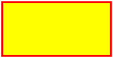
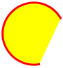
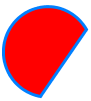
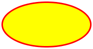
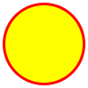

# Perfect Shape 0.0.6
## Geometric Algorithms
[](http://badge.fury.io/rb/perfect-shape)

`PerfectShape` is a collection of pure Ruby geometric algorithms that are mostly useful for GUI (Graphical User Interface) manipulation like checking containment of a mouse click point in popular geometry shapes such as rectangle, square, arc (open, chord, and pie), ellipse, circle, polygon (ray casting algorithm/even-odd rule), polyline, polyquad, polycubic, and paths containing lines, bezier curves, and quadratic curves.

Additionally, `PerfectShape::Math` contains some purely mathematical algorithms.

To ensure high accuracy, this library does all its mathematical operations with `BigDecimal` numbers.

## Setup

Run:

```
gem install perfect-shape -v 0.0.6
```

Or include in Bundler `Gemfile`:

```ruby
gem 'perfect-shape', '~> 0.0.6'
```

And, run:

```
bundle
```

## API

### `PerfectShape::Math`

Module

- `::degrees_to_radians(angle)`: converts degrees to radians
- `::radians_to_degrees(angle)`: converts radians to degrees
- `::normalize_degrees(angle)`: normalizes the specified angle into the range -180 to 180.
- `::ieee_remainder(x, y)` (alias: `ieee754_remainder`): [IEEE 754-1985 Remainder](https://en.wikipedia.org/wiki/IEEE_754-1985) (different from standard % modulo operator as it operates on floats and could return a negative result)

### `PerfectShape::Shape`

Class

- `#normalize_point(x_or_point, y = nil)`: normalizes point into an `Array` of (x,y) coordinates

### `PerfectShape::RectangularShape`

Module

- `#initialize(x: 0, y: 0, width: 1, height: 1)`: initializes a rectangular shape
- `#x`: top-left x
- `#y`: top-left y
- `#width`: width
- `#height`: height
- `#center_x`: center x
- `#center_y`: center y

### `PerfectShape::Line`

Class
Extends `PerfectShape::Shape`

- `::relative_ccw(x1, y1, x2, y2, px, py)`: Returns an indicator of where the specified point (px,py) lies with respect to the line segment from (x1,y1) to (x2,y2). The return value can be either 1, -1, or 0 and indicates in which direction the specified line must pivot around its first end point, (x1,y1), in order to point at the specified point (px,py). A return value of 1 indicates that the line segment must turn in the direction that takes the positive X axis towards the negative Y axis. In the default coordinate system used by Java 2D, this direction is counterclockwise. A return value of -1 indicates that the line segment must turn in the direction that takes the positive X axis towards the positive Y axis. In the default coordinate system, this direction is clockwise. A return value of 0 indicates that the point lies exactly on the line segment. Note that an indicator value of 0 is rare and not useful for determining collinearity because of floating point rounding issues. If the point is colinear with the line segment, but not between the end points, then the value will be -1 if the point lies “beyond (x1,y1)” or 1 if the point lies “beyond (x2,y2)”.

### `PerfectShape::Rectangle`

Class
Extends `PerfectShape::Shape`
Includes `PerfectShape::RectangularShape`



- `::new(x: 0, y: 0, width: 1, height: 1)`: constructs a rectangle
- `#x`: top-left x
- `#y`: top-left y
- `#width`: width
- `#height`: height
- `#center_x`: center x
- `#center_y`: center y
- `#contain?(x_or_point, y=nil)`: checks if point is inside

### `PerfectShape::Square`

Class
Extends `PerfectShape::Rectangle`


- `::new(x: 0, y: 0, length: 1)`: constructs a square
- `#x`: top-left x
- `#y`: top-left y
- `#length`: length
- `#width`: width (equal to length)
- `#height`: height (equal to length)
- `#center_x`: center x
- `#center_y`: center y
- `#contain?(x_or_point, y=nil)`: checks if point is inside

### `PerfectShape::Arc`

Class
Extends `PerfectShape::Shape`
Includes `PerfectShape::RectangularShape`

Arcs can be of type `:open`, `:chord`, or `:pie`

Open Arc | Chord Arc | Pie Arc
---------|-----------|--------
 |  | 

- `::new(type: :open, x: 0, y: 0, width: 1, height: 1, start: 0, extent: 360, center_x: nil, center_y: nil, radius_x: nil, radius_y: nil)`: constructs an arc of type  `:open` (default), `:chord`, or `:pie`
- `#type`: `:open`, `:chord`, or `:pie`
- `#x`: top-left x
- `#y`: top-left y
- `#width`: width
- `#height`: height
- `#start`: start angle in degrees
- `#extent`: extent angle in degrees
- `#center_x`: center x
- `#center_y`: center y
- `#radius_x`: radius along the x-axis
- `#radius_y`: radius along the y-axis
- `#contain?(x_or_point, y=nil)`: checks if point is inside

### `PerfectShape::Ellipse`

Class
Extends `PerfectShape::Arc`



- `::new(x: 0, y: 0, width: 1, height: 1, center_x: nil, center_y: nil, radius_x: nil, radius_y: nil)`: constructs an ellipse
- `#x`: top-left x
- `#y`: top-left y
- `#width`: width
- `#height`: height
- `#center_x`: center x
- `#center_y`: center y
- `#radius_x`: radius along the x-axis
- `#radius_y`: radius along the y-axis
- `#type`: always `:open`
- `#start`: always `0`
- `#extent`: always `360`
- `#contain?(x_or_point, y=nil)`: checks if point is inside

### `PerfectShape::Circle`

Class
Extends `PerfectShape::Ellipse`



- `::new(x: 0, y: 0, diameter: 1, width: 1, height: 1, center_x: nil, center_y: nil, radius: nil, radius_x: nil, radius_y: nil)`: constructs a circle
- `#x`: top-left x
- `#y`: top-left y
- `#diameter`: diameter
- `#width`: width (equal to diameter)
- `#height`: height (equal to diameter)
- `#center_x`: center x
- `#center_y`: center y
- `#radius`: radius
- `#radius_x`: radius along the x-axis (equal to radius)
- `#radius_y`: radius along the y-axis (equal to radius)
- `#type`: always `:open`
- `#start`: always `0`
- `#extent`: always `360`
- `#contain?(x_or_point, y=nil)`: checks if point is inside

## Process

[Glimmer Process](https://github.com/AndyObtiva/glimmer/blob/master/PROCESS.md)

## Resources

- Rubydoc: https://www.rubydoc.info/gems/perfect-shape
- AWT Geom JavaDoc: https://docs.oracle.com/javase/8/docs/api/java/awt/geom/package-summary.html

## TODO

[TODO.md](TODO.md)

## Change Log

[CHANGELOG.md](CHANGELOG.md)

## Contributing

-   Check out the latest master to make sure the feature hasn't been
    implemented or the bug hasn't been fixed yet.
-   Check out the issue tracker to make sure someone already hasn't
    requested it and/or contributed it.
-   Fork the project.
-   Start a feature/bugfix branch.
-   Commit and push until you are happy with your contribution.
-   Make sure to add tests for it. This is important so I don't break it
    in a future version unintentionally.
-   Please try not to mess with the Rakefile, version, or history. If
    you want to have your own version, or is otherwise necessary, that
    is fine, but please isolate to its own commit so I can cherry-pick
    around it.

## Copyright

[MIT](LICENSE.txt)

Copyright (c) 2021 Andy Maleh. See
[LICENSE.txt](LICENSE.txt) for further details.
