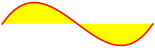

# Perfect Shape 0.1.1
## Geometric Algorithms
[](http://badge.fury.io/rb/perfect-shape)
[](https://github.com/AndyObtiva/perfect-shape/actions/workflows/ruby.yml)

[`PerfectShape`](https://rubygems.org/gems/perfect-shape) is a collection of pure Ruby geometric algorithms that are mostly useful for GUI (Graphical User Interface) manipulation like checking containment of a mouse click [point](#perfectshapepoint) in popular geometry shapes such as [rectangle](#perfectshaperectangle), [square](#perfectshapesquare), [arc](#perfectshapearc) (open, chord, and pie), [ellipse](#perfectshapeellipse), [circle](#perfectshapecircle), [polygon](#perfectshapepolygon), and [paths](#perfectshapepath) containing [lines](#perfectshapeline), [quadratic bézier curves](#perfectshapequadraticbeziercurve), and [cubic bézier curves](#perfectshapecubicbeziercurve) (including both [Ray Casting Algorithm](https://en.wikipedia.org/wiki/Point_in_polygon#Ray_casting_algorithm), aka [Even-odd Rule](https://en.wikipedia.org/wiki/Even%E2%80%93odd_rule), and [Winding Number Algorithm](https://en.wikipedia.org/wiki/Point_in_polygon#Winding_number_algorithm), aka [Nonzero Rule](https://en.wikipedia.org/wiki/Nonzero-rule)).

Additionally, [`PerfectShape::Math`](#perfectshapemath) contains some purely mathematical algorithms, like [IEEE 754-1985 Remainder](https://en.wikipedia.org/wiki/IEEE_754-1985).

To ensure high accuracy, this library does all its mathematical operations with [`BigDecimal`](https://ruby-doc.org/stdlib-3.0.2/libdoc/bigdecimal/rdoc/BigDecimal.html) numbers.

## Setup

Run:

```
gem install perfect-shape -v 0.1.1
```

Or include in Bundler `Gemfile`:

```ruby
gem 'perfect-shape', '~> 0.1.1'
```

And, run:

```
bundle
```

## API

### `PerfectShape::Math`

Module

- `::degrees_to_radians(angle)`: converts degrees to radians
- `::radians_to_degrees(angle)`: converts radians to degrees
- `::normalize_degrees(angle)`: normalizes the specified angle into the range -180 to 180.
- `::ieee_remainder(x, y)` (alias: `ieee754_remainder`): [IEEE 754-1985 Remainder](https://en.wikipedia.org/wiki/IEEE_754-1985) (different from standard % modulo operator as it operates on floats and could return a negative result)

### `PerfectShape::Shape`

Class

This is a base class for all shapes. It is not meant to be used directly. Subclasses implement/override its methods as needed.

- `#min_x`: min x
- `#min_y`: min y
- `#max_x`: max x
- `#max_y`: max y
- `#width`: width
- `#height`: height
- `#center_x`: center x
- `#center_y`: center y
- `#bounding_box`: bounding box is a rectangle with x = min x, y = min y, and width/height just as those of shape
- `#normalize_point(x_or_point, y = nil)`: normalizes point into an `Array` of `[x,y]` coordinates
- `#==(other)`: Returns `true` if equal to `other` or `false` otherwise

### `PerfectShape::PointLocation`

Module

- `#initialize(x: 0, y: 0)`: initializes a point location, usually representing the top-left point in a shape
- `#x`: top-left x
- `#y`: top-left y
- `#min_x`: min x (x by default)
- `#min_y`: min y (y by default)

### `PerfectShape::RectangularShape`

Module

Includes `PerfectShape::PointLocation`

- `#initialize(x: 0, y: 0, width: 1, height: 1)`: initializes a rectangular shape
- `#x`: top-left x
- `#y`: top-left y
- `#width`: width
- `#height`: height
- `#min_x`: min x
- `#min_y`: min y
- `#max_x`: max x
- `#max_y`: max y
- `#center_x`: center x
- `#center_y`: center y
- `#bounding_box`: bounding box is a rectangle with x = min x, y = min y, and width/height of shape

### `PerfectShape::Point`

Class

Extends `PerfectShape::Shape`

Includes `PerfectShape::PointLocation`


Points are simply represented by an `Array` of `[x,y]` coordinates when used within other shapes, but when needing point-specific operations like `point_distance`, the `PerfectShape::Point` class can come in handy.

- `::point_distance(x, y, px, py)`: Returns the distance from a point to another point
- `::new(x_or_point=nil, y_arg=nil, x: nil, y: nil)`: constructs a point with (x,y) pair (default: 0,0) whether specified as `Array` of (x,y) pair, flat `x,y` args, or `x:, y:` kwargs.
- `#min_x`: min x (always x)
- `#min_y`: min y (always y)
- `#max_x`: max x (always x)
- `#max_y`: max y (always y)
- `#width`: width (always 0)
- `#height`: height (always 0)
- `#center_x`: center x (always x)
- `#center_y`: center y (always y)
- `#bounding_box`: bounding box is a rectangle with x = min x, y = min y, and width/height of shape
- `#contain?(x_or_point, y=nil, distance: 0)`: checks if point matches self, with a distance tolerance (0 by default). Distance tolerance provides a fuzz factor that for example enables GUI users to mouse-click-select a point shape in a GUI more successfully.
- `#point_distance(x_or_point, y=nil)`: Returns the distance from a point to another point
- `#==(other)`: Returns `true` if equal to `other` or `false` otherwise

Example:

```ruby
shape = PerfectShape::Point.new(x: 200, y: 150)
```

### `PerfectShape::Line`

Class

Extends `PerfectShape::Shape`

Includes `PerfectShape::MultiPoint`


- `::relative_counterclockwise(x1, y1, x2, y2, px, py)`: Returns an indicator of where the specified point (px,py) lies with respect to the line segment from (x1,y1) to (x2,y2). The return value can be either 1, -1, or 0 and indicates in which direction the specified line must pivot around its first end point, (x1,y1), in order to point at the specified point (px,py). A return value of 1 indicates that the line segment must turn in the direction that takes the positive X axis towards the negative Y axis. In the default coordinate system used by Java 2D, this direction is counterclockwise. A return value of -1 indicates that the line segment must turn in the direction that takes the positive X axis towards the positive Y axis. In the default coordinate system, this direction is clockwise. A return value of 0 indicates that the point lies exactly on the line segment. Note that an indicator value of 0 is rare and not useful for determining collinearity because of floating point rounding issues. If the point is colinear with the line segment, but not between the end points, then the value will be -1 if the point lies “beyond (x1,y1)” or 1 if the point lies “beyond (x2,y2)”.
- `::point_segment_distance_square(x1, y1, x2, y2, px, py)`: Returns the square of distance from a point to a line segment.
- `::point_segment_distance(x1, y1, x2, y2, px, py)`: Returns the distance from a point to a line segment.
- `::new(points: [])`: constructs a line with two `points` as `Array` of `Array`s of `[x,y]` pairs or flattened `Array` of alternating x and y coordinates
- `#min_x`: min x
- `#min_y`: min y
- `#max_x`: max x
- `#max_y`: max y
- `#width`: width (from min x to max x)
- `#height`: height (from min y to max y)
- `#center_x`: center x
- `#center_y`: center y
- `#bounding_box`: bounding box is a rectangle with x = min x, y = min y, and width/height of shape
- `#contain?(x_or_point, y=nil, distance: 0)`: checks if point lies on line, with a distance tolerance (0 by default). Distance tolerance provides a fuzz factor that for example enables GUI users to mouse-click-select a line shape in a GUI more successfully.
- `#relative_counterclockwise(x_or_point, y=nil)`: Returns an indicator of where the specified point (px,py) lies with respect to the line segment from (x1,y1) to (x2,y2). The return value can be either 1, -1, or 0 and indicates in which direction the specified line must pivot around its first end point, (x1,y1), in order to point at the specified point (px,py). A return value of 1 indicates that the line segment must turn in the direction that takes the positive X axis towards the negative Y axis. In the default coordinate system used by Java 2D, this direction is counterclockwise. A return value of -1 indicates that the line segment must turn in the direction that takes the positive X axis towards the positive Y axis. In the default coordinate system, this direction is clockwise. A return value of 0 indicates that the point lies exactly on the line segment. Note that an indicator value of 0 is rare and not useful for determining collinearity because of floating point rounding issues. If the point is colinear with the line segment, but not between the end points, then the value will be -1 if the point lies “beyond (x1,y1)” or 1 if the point lies “beyond (x2,y2)”.
- `#point_segment_distance(x_or_point, y=nil)`: Returns the distance from a point to a line segment.
- `#==(other)`: Returns `true` if equal to `other` or `false` otherwise

Example:

```ruby
shape = PerfectShape::Line.new(points: [[200, 150], [270, 220]]) # start point and end point
```

### `PerfectShape::QuadraticBezierCurve`

Class

Extends `PerfectShape::Shape`

Includes `PerfectShape::MultiPoint`


- `::new(points: [])`: constructs a quadratic bézier curve with three `points` (start point, control point, and end point) as `Array` of `Array`s of `[x,y]` pairs or flattened `Array` of alternating x and y coordinates
- `#points`: points (start point, control point, and end point)
- `#min_x`: min x
- `#min_y`: min y
- `#max_x`: max x
- `#max_y`: max y
- `#width`: width (from min x to max x)
- `#height`: height (from min y to max y)
- `#center_x`: center x
- `#center_y`: center y
- `#bounding_box`: bounding box is a rectangle with x = min x, y = min y, and width/height of shape (bounding box only guarantees that the shape is within it, but it might be bigger than the shape)
- `#contain?(x_or_point, y=nil)`: checks if point is inside
- `#==(other)`: Returns `true` if equal to `other` or `false` otherwise

Example:

```ruby
shape = PerfectShape::QuadraticBezierCurve.new(points: [[200, 150], [270, 220], [180, 170]]) # start point, control point, and end point
```

### `PerfectShape::CubicBezierCurve`

Class

Extends `PerfectShape::Shape`

Includes `PerfectShape::MultiPoint`



- `::new(points: [])`: constructs a cubic bézier curve with four `points` (start point, two control points, and end point) as `Array` of `Array`s of `[x,y]` pairs or flattened `Array` of alternating x and y coordinates
- `#points`: points (start point, two control points, and end point)
- `#min_x`: min x
- `#min_y`: min y
- `#max_x`: max x
- `#max_y`: max y
- `#width`: width (from min x to max x)
- `#height`: height (from min y to max y)
- `#center_x`: center x
- `#center_y`: center y
- `#bounding_box`: bounding box is a rectangle with x = min x, y = min y, and width/height of shape (bounding box only guarantees that the shape is within it, but it might be bigger than the shape)
- `#contain?(x_or_point, y=nil)`: checks if point is inside
- `#==(other)`: Returns `true` if equal to `other` or `false` otherwise

Example:

```ruby
shape = PerfectShape::CubicBezierCurve.new(points: [[200, 150], [230, 50], [270, 220], [180, 170]]) # start point, control point, and end point
```

### `PerfectShape::Rectangle`

Class

Extends `PerfectShape::Shape`

Includes `PerfectShape::RectangularShape`


- `::new(x: 0, y: 0, width: 1, height: 1)`: constructs a rectangle
- `#x`: top-left x
- `#y`: top-left y
- `#width`: width
- `#height`: height
- `#center_x`: center x
- `#center_y`: center y
- `#min_x`: min x
- `#min_y`: min y
- `#max_x`: max x
- `#max_y`: max y
- `#bounding_box`: bounding box is a rectangle with x = min x, y = min y, and width/height of shape
- `#contain?(x_or_point, y=nil)`: checks if point is inside
- `#==(other)`: Returns `true` if equal to `other` or `false` otherwise

Example:

```ruby
shape = PerfectShape::Rectangle.new(x: 15, y: 30, width: 200, height: 100)
```

### `PerfectShape::Square`

Class

Extends `PerfectShape::Rectangle`


- `::new(x: 0, y: 0, length: 1)`: constructs a square
- `#x`: top-left x
- `#y`: top-left y
- `#length`: length
- `#width`: width (equal to length)
- `#height`: height (equal to length)
- `#center_x`: center x
- `#center_y`: center y
- `#min_x`: min x
- `#min_y`: min y
- `#max_x`: max x
- `#max_y`: max y
- `#bounding_box`: bounding box is a rectangle with x = min x, y = min y, and width/height of shape
- `#contain?(x_or_point, y=nil)`: checks if point is inside
- `#==(other)`: Returns `true` if equal to `other` or `false` otherwise

Example:

```ruby
shape = PerfectShape::Square.new(x: 15, y: 30, length: 200)
```

### `PerfectShape::Arc`

Class

Extends `PerfectShape::Shape`

Includes `PerfectShape::RectangularShape`

Arcs can be of type `:open`, `:chord`, or `:pie`

Open Arc | Chord Arc | Pie Arc
---------|-----------|--------
 |  | 

- `::new(type: :open, x: 0, y: 0, width: 1, height: 1, start: 0, extent: 360, center_x: nil, center_y: nil, radius_x: nil, radius_y: nil)`: constructs an arc of type  `:open` (default), `:chord`, or `:pie`
- `#type`: `:open`, `:chord`, or `:pie`
- `#x`: top-left x
- `#y`: top-left y
- `#width`: width
- `#height`: height
- `#start`: start angle in degrees
- `#extent`: extent angle in degrees
- `#center_x`: center x
- `#center_y`: center y
- `#radius_x`: radius along the x-axis
- `#radius_y`: radius along the y-axis
- `#min_x`: min x
- `#min_y`: min y
- `#max_x`: max x
- `#max_y`: max y
- `#bounding_box`: bounding box is a rectangle with x = min x, y = min y, and width/height of shape
- `#contain?(x_or_point, y=nil)`: checks if point is inside
- `#==(other)`: Returns `true` if equal to `other` or `false` otherwise

Example:

```ruby
shape = PerfectShape::Arc.new(type: :chord, x: 2, y: 3, width: 50, height: 60, start: 30, extent: 90)
shape2 = PerfectShape::Arc.new(type: :chord, center_x: 2 + 25, center_y: 3 + 30, radius_x: 25, radius_y: 30, start: 30, extent: 90)
```

### `PerfectShape::Ellipse`

Class

Extends `PerfectShape::Arc`


- `::new(x: 0, y: 0, width: 1, height: 1, center_x: nil, center_y: nil, radius_x: nil, radius_y: nil)`: constructs an ellipse
- `#x`: top-left x
- `#y`: top-left y
- `#width`: width
- `#height`: height
- `#center_x`: center x
- `#center_y`: center y
- `#radius_x`: radius along the x-axis
- `#radius_y`: radius along the y-axis
- `#type`: always `:open`
- `#start`: always `0`
- `#extent`: always `360`
- `#min_x`: min x
- `#min_y`: min y
- `#max_x`: max x
- `#max_y`: max y
- `#bounding_box`: bounding box is a rectangle with x = min x, y = min y, and width/height of shape
- `#contain?(x_or_point, y=nil)`: checks if point is inside
- `#==(other)`: Returns `true` if equal to `other` or `false` otherwise

Example:

```ruby
shape = PerfectShape::Ellipse.new(x: 2, y: 3, width: 50, height: 60)
shape2 = PerfectShape::Ellipse.new(center_x: 27, center_y: 33, radius_x: 25, radius_y: 30)
```

### `PerfectShape::Circle`

Class

Extends `PerfectShape::Ellipse`


- `::new(x: 0, y: 0, diameter: 1, width: 1, height: 1, center_x: nil, center_y: nil, radius: nil, radius_x: nil, radius_y: nil)`: constructs a circle
- `#x`: top-left x
- `#y`: top-left y
- `#diameter`: diameter
- `#width`: width (equal to diameter)
- `#height`: height (equal to diameter)
- `#center_x`: center x
- `#center_y`: center y
- `#radius`: radius
- `#radius_x`: radius along the x-axis (equal to radius)
- `#radius_y`: radius along the y-axis (equal to radius)
- `#type`: always `:open`
- `#start`: always `0`
- `#extent`: always `360`
- `#min_x`: min x
- `#min_y`: min y
- `#max_x`: max x
- `#max_y`: max y
- `#bounding_box`: bounding box is a rectangle with x = min x, y = min y, and width/height of shape
- `#contain?(x_or_point, y=nil)`: checks if point is inside
- `#==(other)`: Returns `true` if equal to `other` or `false` otherwise

Example:

```ruby
shape = PerfectShape::Circle.new(x: 2, y: 3, diameter: 60)
shape2 = PerfectShape::Circle.new(center_x: 2 + 30, center_y: 3 + 30, radius: 30)
```

### `PerfectShape::Polygon`

Class

Extends `PerfectShape::Shape`

Includes `PerfectShape::MultiPoint`

A polygon can be thought of as a special case of [path](#perfectshapepath) that is closed, has the [Even-Odd](https://en.wikipedia.org/wiki/Even%E2%80%93odd_rule) winding rule, and consists of lines only.


- `::new(points: [])`: constructs a polygon with `points` as `Array` of `Array`s of `[x,y]` pairs or flattened `Array` of alternating x and y coordinates
- `#min_x`: min x
- `#min_y`: min y
- `#max_x`: max x
- `#max_y`: max y
- `#width`: width (from min x to max x)
- `#height`: height (from min y to max y)
- `#center_x`: center x
- `#center_y`: center y
- `#bounding_box`: bounding box is a rectangle with x = min x, y = min y, and width/height of shape
- `#contain?(x_or_point, y=nil)`: checks if point is inside using the [Ray Casting Algorithm](https://en.wikipedia.org/wiki/Point_in_polygon) (aka [Even-Odd Rule](https://en.wikipedia.org/wiki/Even%E2%80%93odd_rule))
- `#==(other)`: Returns `true` if equal to `other` or `false` otherwise

Example:

```ruby
shape = PerfectShape::Polygon.new(points: [[200, 150], [270, 170], [250, 220], [220, 190], [200, 200], [180, 170]])
```

### `PerfectShape::Path`

Class

Extends `PerfectShape::Shape`

Includes `PerfectShape::MultiPoint`


- `::new(shapes: [], closed: false, winding_rule: :wind_non_zero)`: constructs a path with `shapes` as `Array` of shape objects, which can be `PerfectShape::Point` (or `Array` of `[x, y]` coordinates), `PerfectShape::Line`, `PerfectShape::QuadraticBezierCurve`, or `PerfectShape::CubicBezierCurve`. If a path is closed, its last point is automatically connected to its first point with a line segment. The winding rule can be `:wind_non_zero` (default) or `:wind_even_odd`.
- `#shapes`: the shapes that the path is composed of (must always start with `PerfectShape::Point` or Array of [x,y] coordinates representing start point)
- `#closed?`: returns `true` if closed and `false` otherwise
- `#winding_rule`: returns winding rule (`:wind_non_zero` or `:wind_even_odd`)
- `#points`: path points calculated (derived) from shapes
- `#min_x`: min x
- `#min_y`: min y
- `#max_x`: max x
- `#max_y`: max y
- `#width`: width (from min x to max x)
- `#height`: height (from min y to max y)
- `#center_x`: center x
- `#center_y`: center y
- `#bounding_box`: bounding box is a rectangle with x = min x, y = min y, and width/height of shape (bounding box only guarantees that the shape is within it, but it might be bigger than the shape)
- `#contain?(x_or_point, y=nil)`: checks if point is inside path utilizing the configured winding rule, which can be the [Nonzero-Rule](https://en.wikipedia.org/wiki/Nonzero-rule) (aka [Winding Number Algorithm](https://en.wikipedia.org/wiki/Point_in_polygon#Winding_number_algorithm)) or the [Even-Odd Rule](https://en.wikipedia.org/wiki/Even%E2%80%93odd_rule) (aka [Ray Casting Algorithm](https://en.wikipedia.org/wiki/Point_in_polygon#Ray_casting_algorithm))
- `#point_crossings(x_or_point, y=nil)`: calculates the number of times the given path crosses the ray extending to the right from (x,y)
- `#==(other)`: Returns `true` if equal to `other` or `false` otherwise

Example:

```ruby
path_shapes = []
path_shapes << PerfectShape::Point.new(x: 200, y: 150)
path_shapes << PerfectShape::Line.new(points: [250, 170]) # no need for start point, just end point
path_shapes << PerfectShape::QuadraticBezierCurve.new(points: [[300, 185], [350, 150]]) # no need for start point, just control point and end point
path_shapes << PerfectShape::CubicBezierCurve.new(points: [[370, 50], [430, 220], [480, 170]]) # no need for start point, just two control points and end point

shape = PerfectShape::Path.new(shapes: path_shapes, closed: false, winding_rule: :wind_even_odd)
```

## Process

[Glimmer Process](https://github.com/AndyObtiva/glimmer/blob/master/PROCESS.md)

## Resources

- Rubydoc: https://www.rubydoc.info/gems/perfect-shape
- AWT Geom JavaDoc (inspiration): https://docs.oracle.com/javase/8/docs/api/java/awt/geom/package-summary.html

## TODO

[TODO.md](TODO.md)

## Change Log

[CHANGELOG.md](CHANGELOG.md)

## Contributing

-   Check out the latest master to make sure the feature hasn't been
    implemented or the bug hasn't been fixed yet.
-   Check out the issue tracker to make sure someone already hasn't
    requested it and/or contributed it.
-   Fork the project.
-   Start a feature/bugfix branch.
-   Commit and push until you are happy with your contribution.
-   Make sure to add tests for it. This is important so I don't break it
    in a future version unintentionally.
-   Please try not to mess with the Rakefile, version, or history. If
    you want to have your own version, or is otherwise necessary, that
    is fine, but please isolate to its own commit so I can cherry-pick
    around it.

## Copyright

[MIT](LICENSE.txt)

Copyright (c) 2021 Andy Maleh. See
[LICENSE.txt](LICENSE.txt) for further details.
